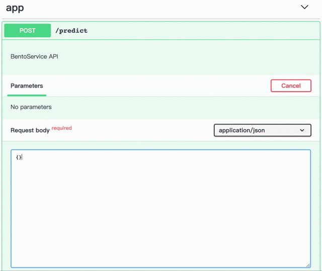

# Stress Analysis in Social Media 
Social media is one of the most common way for people to express "stress" nowadays. Therefore, I conducted a sentiment 
analysis to extract information and identify stress from social media posts. This project leverages the power of 
natural language processing (NLP) and supervised learning to build models that accurately classify stressful and 
non-stressful posts. It was inspired by the newly published paper called
[Dreaddit: A Reddit Dataset for Stress Analysis in Social Media](https://arxiv.org/abs/1911.00133).

For more information, please check out [Slides](bit.ly/37WNKbu)

## Requisites
- MacOS or Linux
- Python 3.7.4
- conda 
- pip
- GPU (To run BERT model)

## Setup
This project requires Python 3.7.4 and conda environment. To setup the environment, please follow these steps:

- Create a new conda virtual environment in local or cloud services
```
conda create -n new_env python=3.7.4 
conda activate new_env 
```
- Clone the github repository
```
git clone https://github.com/gillian850413/Insight_Stress_Analysis.git
```
- Install the required packages in the conda environment
```
cd build
conda install pip
pip install -r requiremnts.txt
```
- For first time using running the project, you need to download some important data packages
```
cd new_env
python config.py
```

## Run Word2Vec Model with REST API
I served the stress analysis model with Python BentoML package, which is a package that supports serving and 
deploying machine learning models to production API in the cloud. The model I used for production is 
"Word2Vec + Tf-idf" model. 

### Run REST API Locally with BentoML
```
cd model
bentoml serve model
```

#### Send Predict Request
You can also run the API directly in terminal by sending prediction request with curl from command line. 
Here is an example:
```
curl -i \
  --header "Content-Type: application/json" \
  --request POST \
  --data '["I like you", "I feel stressful"]' \
  http://localhost:5000/predict
```
Or python and request library:
```
import requests
response = requests.post("http://127.0.0.1:5000/predict", json=["I like you", "I feel stressful"])
print(response.text)
```
You can replace ["I like you", "I feel stressful"] to your own text.

### Run REST API on cloud service
API Link: https://sentiment-ghxotopljq-uw.a.run.app

To test the API, we can use REST API's UI. Click the  "app/predict" function and input the texts you want to predict. 
You can input one or multiple sentences. Here is an valid input example:
```
["It's Friday, wish you have a nice weekend!", "Be Happy, keep smiling!"]
```
Check "Analysis" section for API demo. If you would like to deploy the model to your own cloud service, please check BentoML's 
[Deploy Model Document](https://docs.bentoml.org/en/latest/deployment/index.html).


## Analysis
In this project, I trained the dataset with three feature extraction models TF-IDF, Word2Vec with TF-IDF as weights and 
BERT. After extracting the features, I trained the features with traditional classification models such as logistic
regression, SVM and random forest. Besides, BERT uses a fine tuning neural network to classify the text based on sentences. 

### Overall model results
- Recall is the most important metric because we want to identify the stress posts accurately. However, we also want to prevent
misclassifying a lot of non-stress posts as stress post. 
- Although word2vec+tfidf with random forest has the highest recall, it also misclassified a lot of non-stress as stress 
(low precision). 
    - Some sentences may look non-stress, but they include words with high tfidf weights in stress posts (from train set),
    which may make them be classified as stress.
    
- BERT is the most stable model in this case, with a balanced FP and FN. 
- Both model can predict whether the text is stressful or non stressful and provide a confidence score

| Feature Extraction Model | Best Classification Model | Precision | Recall | F1-Score |
| :-------------    | :-------------  | :-------- |:-------| :------- |
| TF-IDF            | Logistic Regression         | 75.1%     | 75.7%  | 75.4%    |
| Word2Vec + TF-IDF | Random Forest   | 69.4%     | 84.8%  | 76.3%    |
| BERT              | Fine Tuning NN  | 80.8%     | 81.0%  | 80.9%    |

### Word2Vec (with TF-IDF) Prediction 


### BERT Prediction


For more information, please check notebook directory to see the analysis results of different models.


## Reference
- [[NLP] Performance of Different Word Embeddings on Text Classification](https://towardsdatascience.com/nlp-performance-of-different-word-embeddings-on-text-classification-de648c6262b)
- [Predicting Movie Reviews with BERT on TF Hub](https://colab.research.google.com/github/google-research/bert/blob/master/predicting_movie_reviews_with_bert_on_tf_hub.ipynb)

